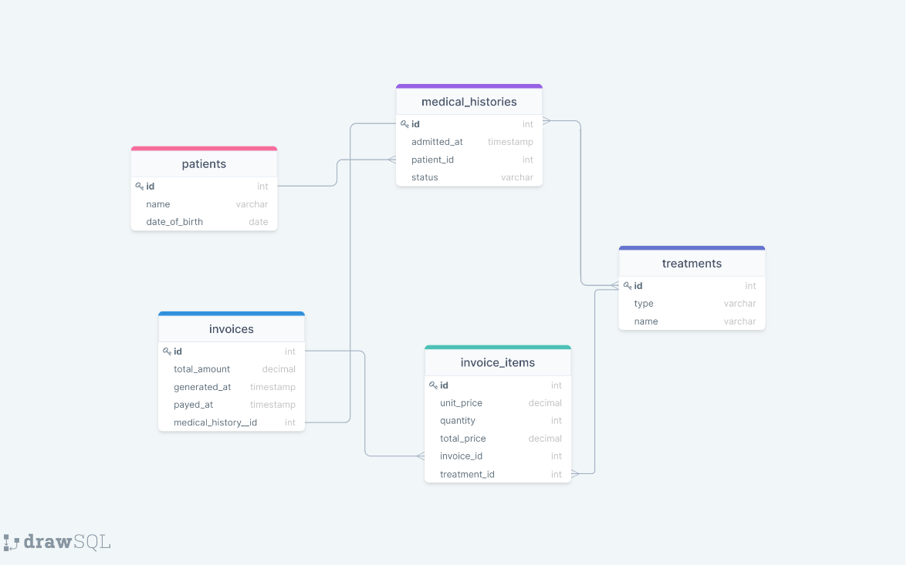

<div align="center">
  <h3><b>Hospital Schema</b></h3>
</div>


<br/>

## Getting Started

This repository includes files with plain SQL that can be used to recreate a database:

- Use [schema.sql](./schema.sql) to create all tables.
- Use [data.sql](./data.sql) to populate tables with sample data.
- Check [queries.sql](./queries.sql) for examples of queries that can be run on a newly created database. **Important note: this file might include queries that make changes in the database (e.g., remove records). Use them responsibly!**

<a name="readme-top"></a>


# 📗 Table of Contents

- [📗 Table of Contents](#-table-of-contents)
- [📖 \[Hospital Schema\] ](#-hospital-schema-)
  - [🛠 Built With SQL](#-built-with-sql)
    - [Tech Stack PostgreSQL](#tech-stack-postgresql)
  - [💻 Getting Started ](#-getting-started-)
    - [Setup](#setup)
  - [👥 Authors ](#-authors-)
  - [🤝 Contributing ](#-contributing-)
  - [⭐️ Show your support ](#️-show-your-support-)
  - [📝 License ](#-license-)

# 📖 [Hospital Schema] <a name="about-project"></a>

**[Hospital Schema]** is a project that interpret a database diagram and implement the SQL.

## 🛠 Built With <a name="built-with">SQL</a>

### Tech Stack <a name="tech-stack">PostgreSQL</a>

<details>
<summary>Database</summary>
  <ul>
    <li><a href="https://www.postgresql.org/">PostgreSQL</a></li>
  </ul>
</details>


<p align="right">(<a href="#readme-top">back to top</a>)</p>

## 💻 Getting Started <a name="getting-started"></a>

This repository includes files with plain SQL that can be used to recreate a database:

- Use schema.sql to create all tables.
- Use data.sql to populate tables with sample data.
- Check queries.sql for examples of queries that can be run on a newly created database. Important note: this file might include queries that make changes in the database (e.g., remove records). Use them responsibly!


### Setup

Clone this repository to your desired folder:


```sh
  cd my-folder
  git clone https://github.com/carreraprogrammer/database_from_diagram.git
```

## 👥 Authors <a name="authors"></a>

👤 **Damiel Carrera**

- GitHub: [@carreraprogrammer](https://github.com/carreraprogrammer )
- Twitter: [@carreraprog](https://twitter.com/carreraprog)
- LinkedIn: [LinkedIn](https://www.linkedin.com/in/daniel-carrera-85a917244/)

👤 **ITALO**

- GitHub: [@storres20](https://github.com/storres20)
- Twitter: [@italolonkan](https://twitter.com/italolonkan)
- LinkedIn: [LinkedIn](https://linkedin.com/in/italo-lon-kan)


## 🤝 Contributing <a name="contributing"></a>

Contributions, issues, and feature requests are welcome!

Feel free to check the [issues page](https://github.com/carreraprogrammer/database_from_diagram/issues).

<p align="right">(<a href="#readme-top">back to top</a>)</p>

## ⭐️ Show your support <a name="support"></a>


If you like this project I really appreciate if you can give me a star and follow me

<p align="right">(<a href="#readme-top">back to top</a>)</p>

## 📝 License <a name="license"></a>

This project is [MIT](./MIT.md) licensed.

<p align="right">(<a href="#readme-top">back to top</a>)</p>
